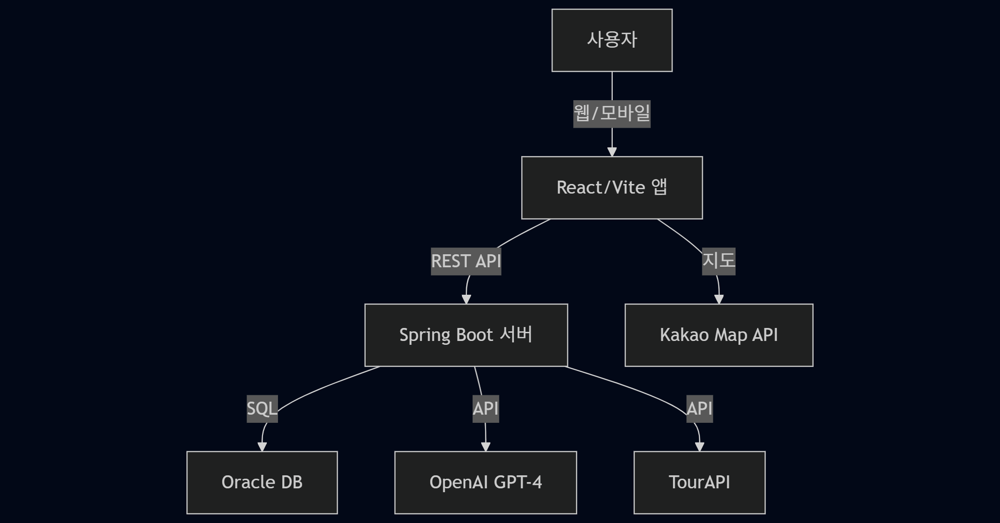
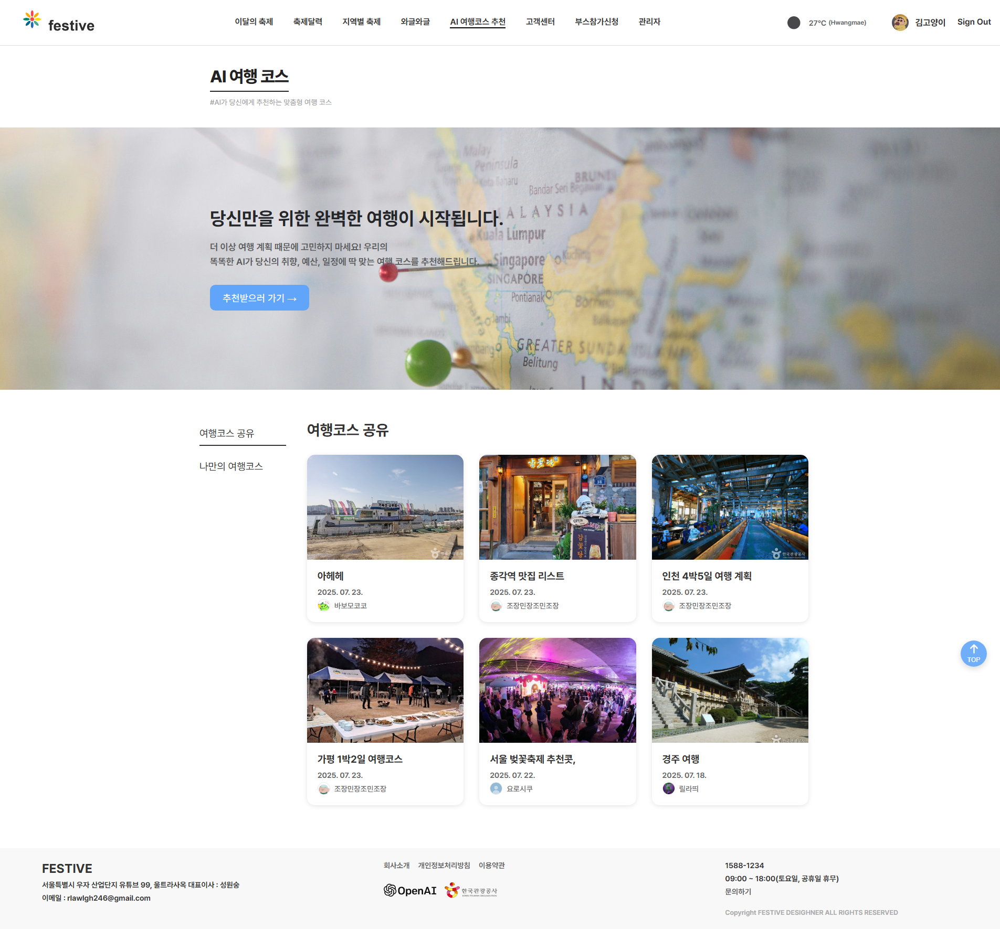
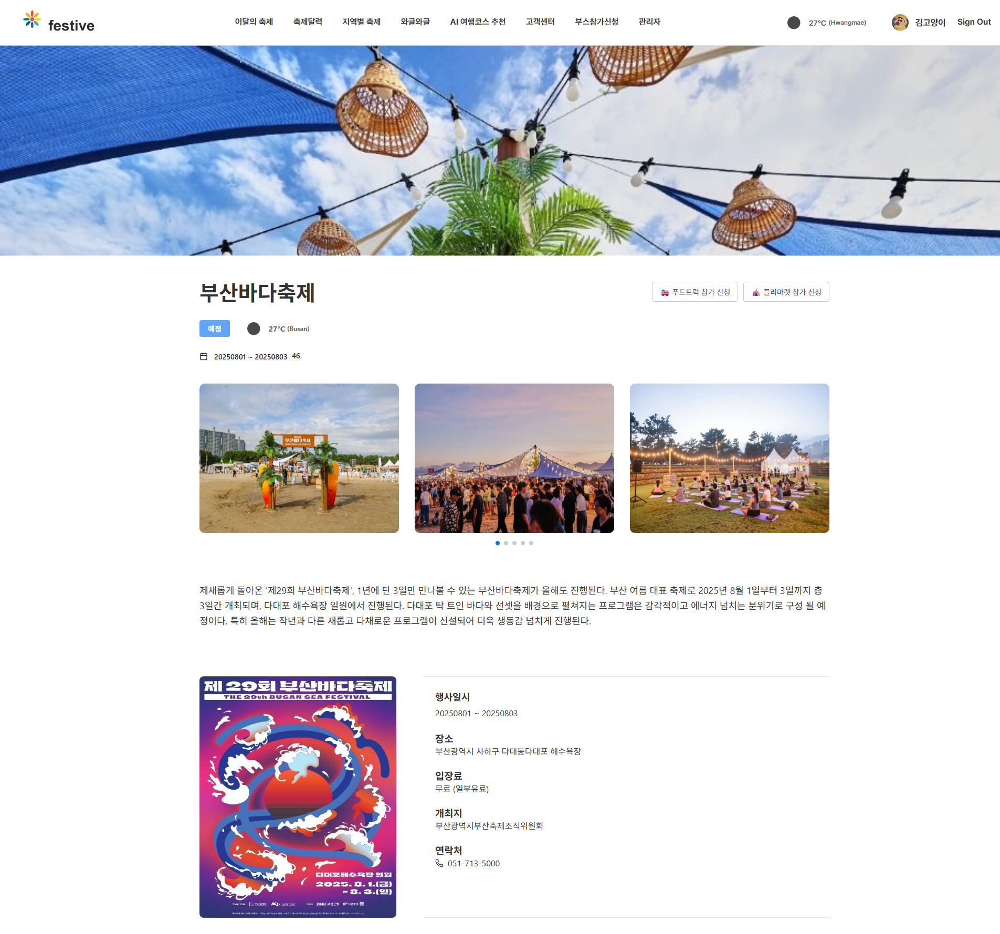
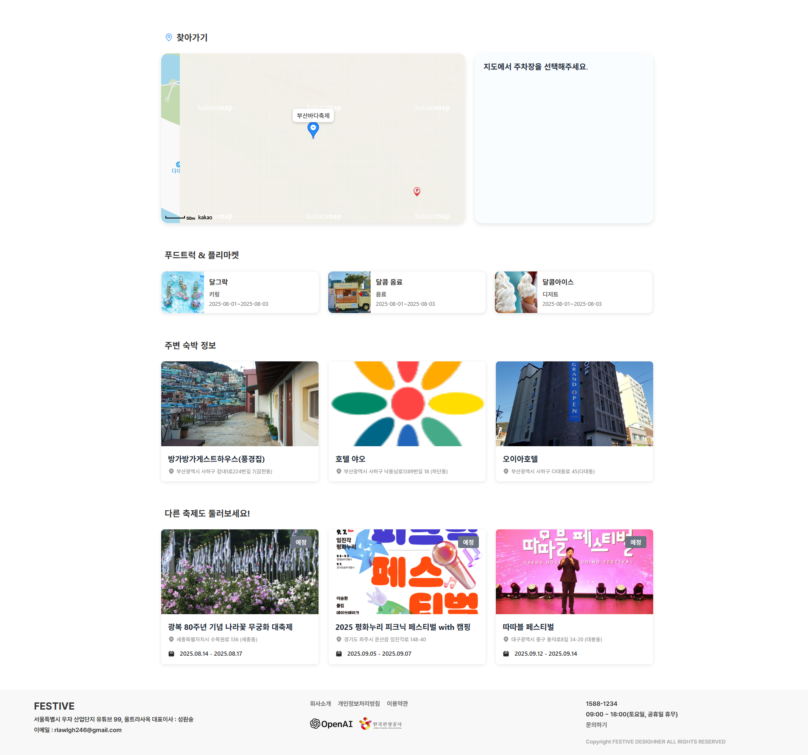
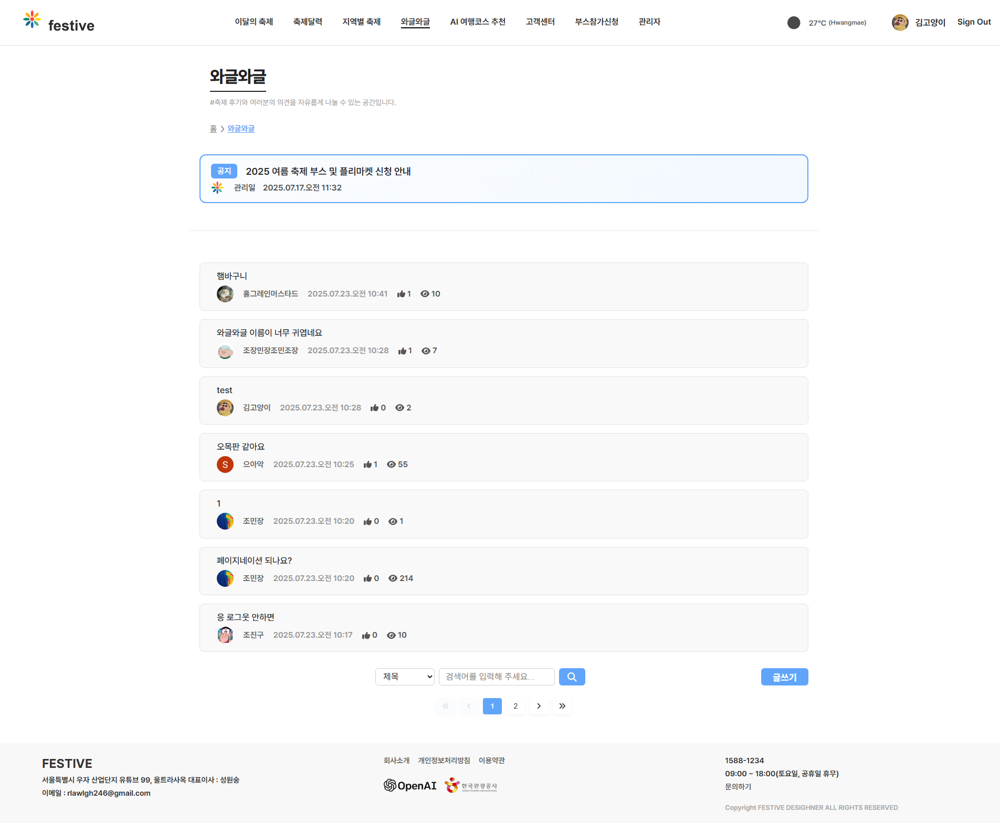
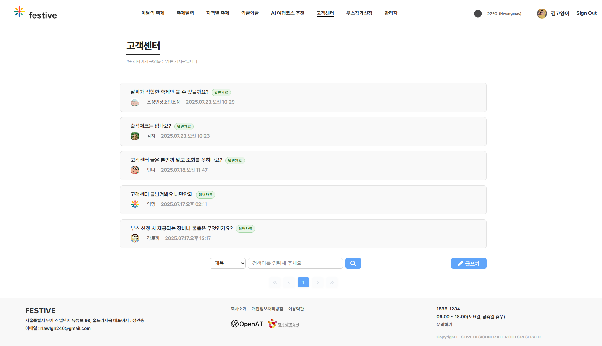
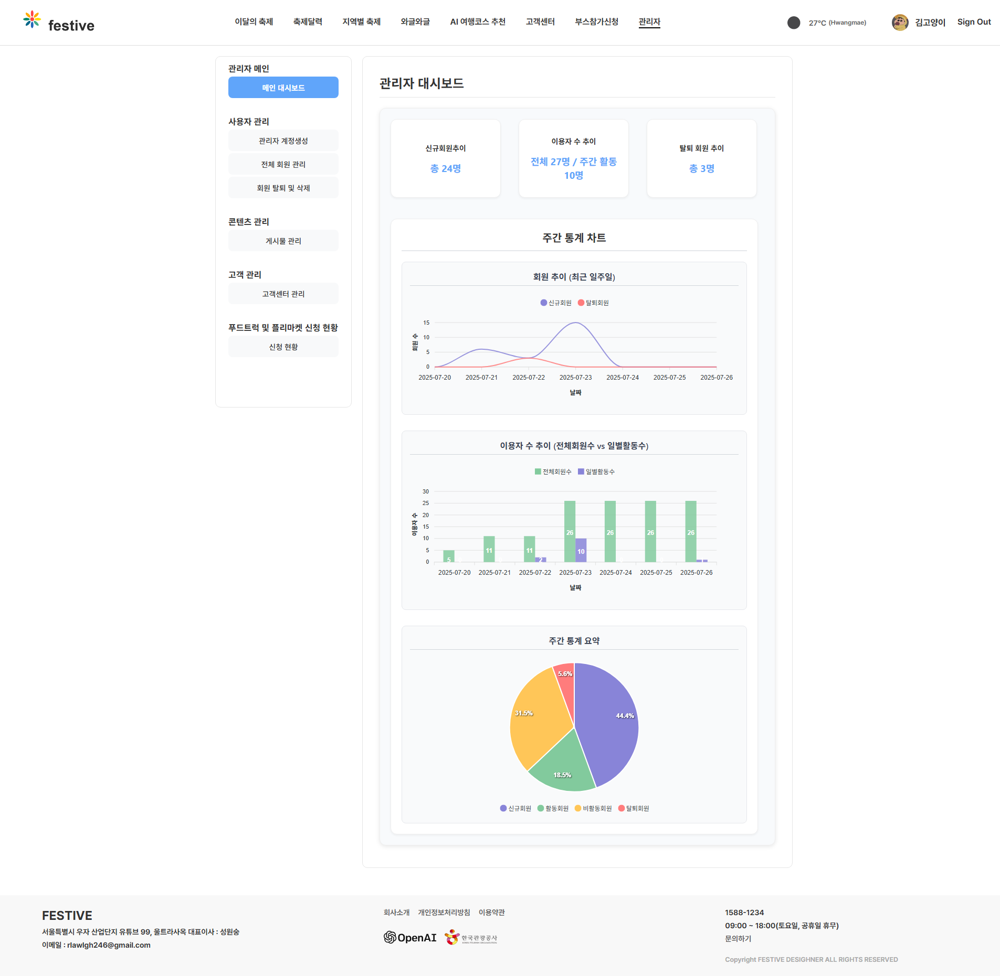
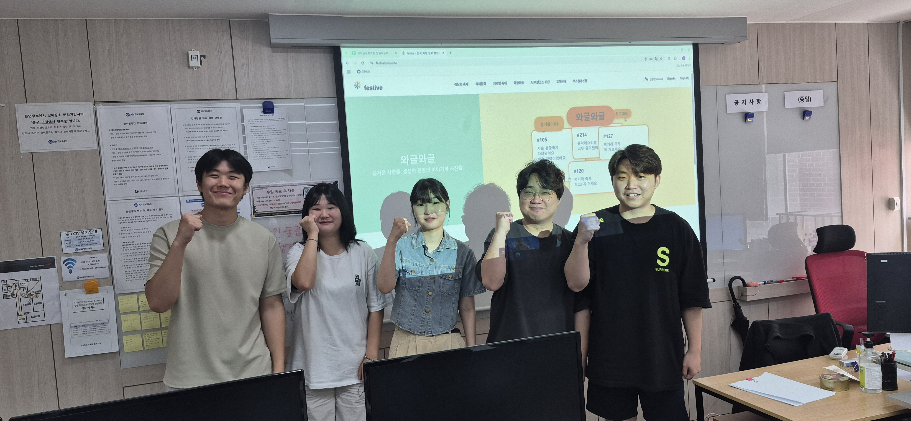

[](https://festivekorea.site)
[](https://reactjs.org/)
[](https://spring.io/)
[](https://openai.com/)

#### _Festive - 한국관광공사 TourAPI와 OpenAI를 활용한 **종합 축제 정보 서비스**_

---

### 📑 목차 (Table of Contents)
- [프로젝트 소개](#-프로젝트-소개)
- [기술 스택 및 아키텍처](#-기술-스택-및-아키텍처)
- [주요 기능](#-주요-기능)
- [설치 및 실행 가이드](#-설치-및-실행-가이드)
- [라이브 데모 및 스크린샷](#-라이브-데모-및-스크린샷)
- [기여 가이드라인](#-기여-가이드라인)
- [커뮤니티 및 지원](#-커뮤니티-및-지원)

---

### 🏆 프로젝트 소개

> **FESTIVE**는 공공데이터 기반의 신뢰도 높은 축제 정보와 OpenAI를 활용한 AI 맞춤형 여행 코스 제공하고, 커뮤니티를 통해 경험과 후기를 자유롭게 공유할 수 있는 종합 플랫폼입니다.

**문제 정의:**
  > - 기존 축제 정보 서비스의 불편한 UI
  > - 단순 정보 제공 위주

**해결책:**
  > - TourAPI & OpenAI 기반 AI 추천으로 누구나 쉽고 정확하게 축제와 여행 코스를 찾을 수 있습니다.
  > - 단순한 정보 제공을 넘어 경험을 공유하고 나눌 수 있도록 커뮤니티를 조성하였습니다.
  > - 직관적인 UI로 사용자의 편의성을 고려하였습니다.

**차별화 포인트:**

🔐 **통합 인증** (일반+소셜, JWT, 보안 강화)

🧠 **AI 맞춤 추천** (실제 데이터 기반)

👥 **커뮤니티** (후기, 리뷰)


---

### 🛠 기술 스택 및 아키텍처

| 프론트엔드 |                    백엔드                    | 데이터베이스 | 외부 API | 배포/DevOps |
|:---:|:-----------------------------------------:|:---:|:---:|:---:|
| React 18, Vite, Zustand, React Router, Axios, Kakao Map API | Spring Boot 3.5, Spring Security, MyBatis | Oracle DB | OpenAI GPT-4, TourAPI, 공공데이터포털, OAuth2 | Vercel, AWS EC2 |

- **인증/보안:** JWT, BCrypt, OAuth2 (Google/Naver/Kakao)
- **환경 분리:** 개발/운영 환경 분리, 환경변수 관리

<details>
<summary>🗺️ <b>아키텍처 개요 (Mermaid)</b></summary>



</details>

---

### ✨ 주요 기능

| 기능 |               설명                |
|:---:|:-------------------------------:|
| **실시간 축제 정보** | TourAPI 연동, 최신 축제/관광지/숙박 정보 제공 |
| **통합 인증** | 일반+소셜 로그인, JWT/BCrypt 보안 |
| **AI 여행 추천** | OpenAI와 실제 관광 데이터 결합, 맞춤형 코스 추천 |
| **커뮤니티/부스 신청** | 게시판, 관리자 대시보드, 부스 신청 |

---

### 🏗 설치 및 실행 가이드

#### 필수 요구사항
- Node.js 22+
- Java 21+
- Oracle Database 18+

#### 설치 및 실행
```bash
# 저장소 클론
git clone https://github.com/KH-FinProject/festive.git
cd festive

# 프론트엔드 실행
cd festive-app
npm install
npm run dev

# 백엔드 실행 (새 터미널)
cd festiveServer
./gradlew bootRun
```

#### 환경변수 예시
```
# .env (프론트엔드)
VITE_API_URL=http://localhost:8080
VITE_KAKAO_MAP_API_KEY=your_kakao_key
VITE_TOURAPI_KEY=your_tour_api_key
VITE_PUBLIC_CARPARK_API=your_parking_api_key

# application-local.properties (백엔드)
spring.datasource.url=jdbc:oracle:thin:@localhost:1521:xe
spring.datasource.username=your_username
spring.datasource.password=your_password
openai.api.key=your_openai_key
```

<details>
<summary>💡 <b>문제 해결 팁</b></summary>

- npm install 오류 시 npm install --legacy-peer-deps로 재시도하세요. (ToastUI - React 18 ver. 호환 이슈)
- Oracle DB 연결 오류 시 포트/계정 정보를 재확인하세요.
- API Key는 노출되지 않도록 .env, application-local.properties를 gitignore에 추가하세요.
</details>

---

### 🌐 라이브 데모 및 스크린샷

- **Live Demo:** [https://festivekorea.site](https://festivekorea.site)

|                       메인 페이지                     |                      AI 추천                     |
|:---------------------------------------------------:|:-----------------------------------------------:|
|  |  |

<details>
<summary>🖼️ <b>추가 스크린샷</b></summary>

|                           축제 상세                        |                           축제 상세                         |
|:---------------------------------------------------------:|:---------------------------------------------------------:|
|  |  |

|                      커뮤니티(와글와글)                  |                          커뮤니티(고객센터)                      |                              관리자                            |
|:-----------------------------------------------------:|:-------------------------------------------------------------:|:-------------------------------------------------------------:|
|  |        |  |

</details>

---

### 🤝 기여 가이드라인

- **기여 방법:** 버그 리포트, 기능 제안, 코드/문서 기여 모두 환영합니다.
- **버그 리포트:** [GitHub Issues](https://github.com/KH-FinProject/festive/issues)에 상세히 작성해 주세요.
- **기능 제안:** [GitHub Discussions](https://github.com/KH-FinProject/festive/discussions)에 상세히 작성해 주세요.
- **코드 스타일:** ESLint, Prettier 적용

---

### 🧑‍💻 커뮤니티 및 지원

- **GitHub Issues:** [바로가기](https://github.com/KH-FinProject/festive/issues)
- **GitHub Discussions:** [바로가기](https://github.com/KH-FinProject/festive/discussions)
- **이메일:** s413625@gmail.com
- **포트폴리오:** [프로젝트 상세 설명](https://festivekorea.site)

<details>
<summary>❓ <b>FAQ (자주 묻는 질문)</b></summary>

- **Q: 앱이 로딩되지 않아요.**
  - A: 네트워크 연결 및 API Key 설정을 확인해 주세요.
- **Q: Oracle DB가 연결되지 않아요.**
  - A: DB 포트, 계정, 방화벽 설정을 점검하세요.
- **Q: AI 추천이 동작하지 않아요.**
  - A: OpenAI API Key가 올바른지 확인하세요.

</details>

---



> *"열정적으로 배우고, 더 정진하겠습니다!"* - festive 팀원 일동 -
